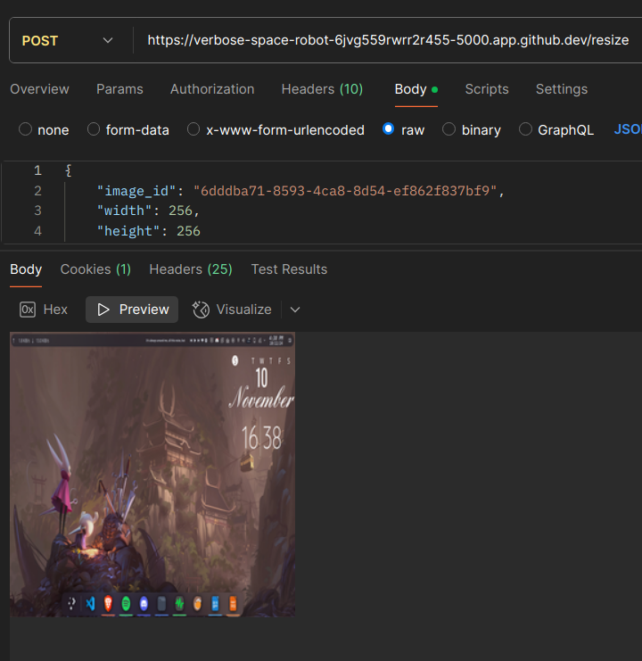
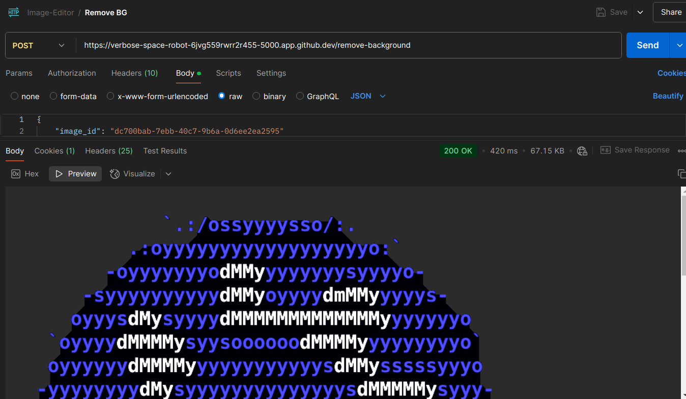
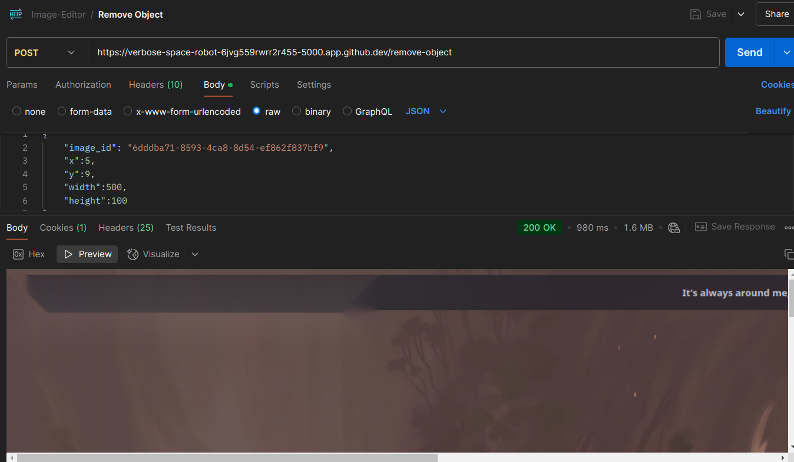
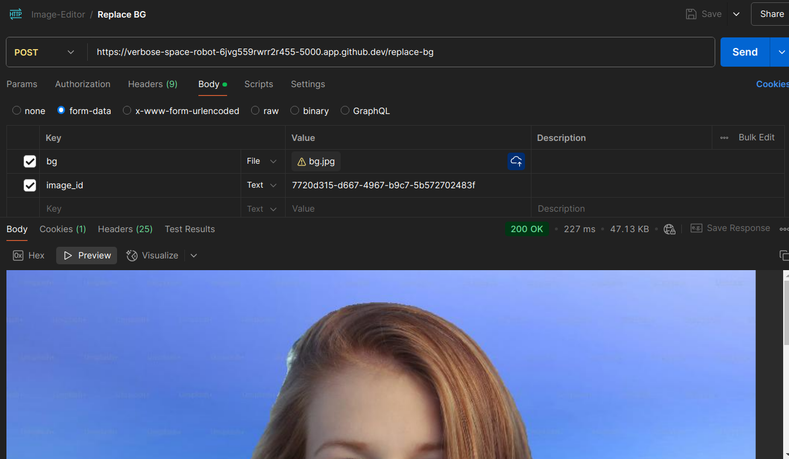
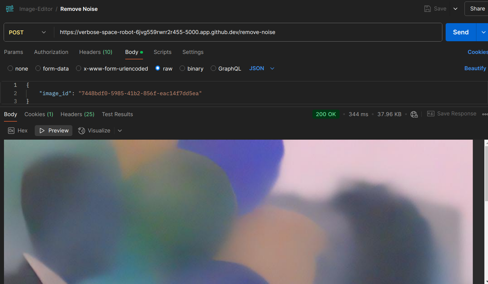
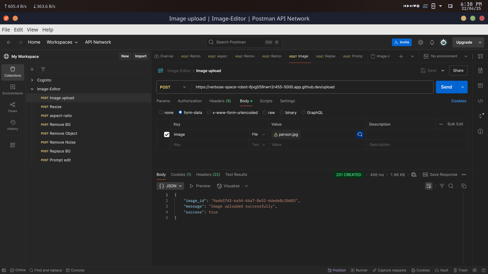
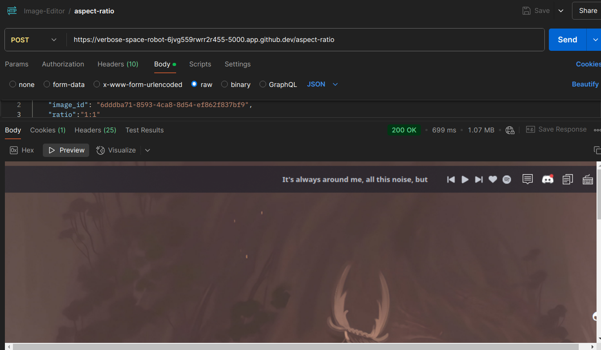

# 🧠 AI Image Editor

A Flask-based AI-powered image editing app that allows prompt-based editing, background removal, object removal, and more. Powered by cutting-edge models like **Segment Anything** and **InstructPix2Pix**, and orchestrated with **Celery** for async processing.

---

## 📁 Folder Structure
```
AI-ImageEditor/
├── app/
│   ├── __init__.py
│   ├── routes/
│   │   ├── editing.py
│   │   ├── cleanup.py
│   │   ├── resize.py
│   ├── utils/
│   │   └── image_utils.py
│   ├── tasks.py
│   └── storage.py
├── weights/
│   └── sam_vit_b_01ec64.pth
├── static/processed/
├── Dockerfile
├── celery_worker.dockerfile
├── docker-compose.yml
├── requirements.txt
├── wsgi.py
└── README.md
```


---

## ⚙️ Setup Instructions

### 🐳 Docker Setup

```bash
git clone https://github.com/ShlokArora2709/AI-ImageEditor.git
cd AI-ImageEditor

# Build & run containers
docker-compose up --build
```


---

## 🔌 API Documentation

### 🖼️ Image Upload

| Endpoint | Method | Payload | Description |
|---------|--------|---------|-------------|
| /upload | POST | image (form-data) | Uploads an image and returns a unique image_id |

---

### 🪄 Editing APIs

| Endpoint | Method | Payload | Description |
|----------|--------|---------|-------------|
| /prompt-edit | POST | image_id, prompt (JSON) | Edits image using prompt (e.g., "make the sky pink") |
| /task-status/<task_id> | GET | - | Gets Celery task status and result |
| /replace-bg | POST | image_id (form), bg (form-data image) | Replaces background using SAM and uploaded image |

---

### 🧹 Cleanup APIs

| Endpoint | Method | Payload | Description |
|----------|--------|---------|-------------|
| /remove-background | POST | image_id (JSON) | Removes the background using SAM |
| /remove-object | POST | image_id, x, y, width, height (JSON) | Removes specified region using segmentation |
| /remove-noise | POST | image_id (JSON) | Denoises the image using Real-ESRGAN or similar |

---

### 📐 Resize APIs

| Endpoint | Method | Payload | Description |
|----------|--------|---------|-------------|
| /resize | POST | image_id, width, height (JSON) | Resizes image to target dimensions |
| /aspect-ratio | POST | image_id, ratio (e.g., 16:9) (JSON) | Crops/resizes image to desired aspect ratio |

---

## 🧵 Background Task with Celery

| Function | Parameters | Description |
|----------|------------|-------------|
| run_prompt_edit | image_id, prompt, upload_folder | Background prompt-based edit task triggered via Celery |

---

## 🖼️ Demo
| Feature | Preview |
|--------|---------|
| **Image Upload** |  |
| **Remove Background** |  |
| **Remove Object** |  |
| **Replace Background** |  |
| **Remove Noise** |  |
| **Resize Image** |  |
| **Aspect Ratio Resize** |  |
---

##  [Postman Collection](https://www.postman.com/pine-backend/workspace/my-workspace/collection/34644946-2af0ed97-35e9-47a7-8b4d-d827b0fc4d56?action=share&creator=34644946)


## 🙌 Credits

- [Segment Anything](https://github.com/facebookresearch/segment-anything) by Meta AI
- [InstructPix2Pix](https://huggingface.co/timbrooks/instruct-pix2pix)
- [Real-ESRGAN](https://github.com/xinntao/Real-ESRGAN)

---